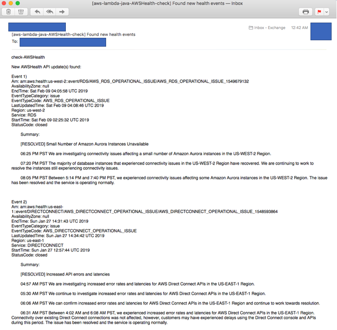

## AWS Lambda Java module for periodic checking of new AWS Health events

Java SAM Lambda module for periodical checking of AWS Health API for new events and notify via SES if updates are found.



## License Summary

This sample code is made available under a modified MIT license. See the LICENSE file.

## AWS Costs
AWS Lambda Invocation (Usually Free https://aws.amazon.com/free/)  
Amazon SES (Usually Free https://aws.amazon.com/free/)  
Minimal Amazon S3 Usage  
AWS Support for AWS Health API access (Requires at least Business Support Plan)  
https://aws.amazon.com/premiumsupport/pricing

## Prerequisites
awscli - https://aws.amazon.com/cli/  

configure AWS credentials for target account  
`aws configure` 

Verified Amazon SES Sender email  
https://docs.aws.amazon.com/ses/latest/DeveloperGuide/verify-email-addresses.html  
If you verify an email, you can send from/to that address.
To send to other addresses, you need to move SES out of sandbox mode:  
https://docs.aws.amazon.com/ses/latest/DeveloperGuide/request-production-access.html  
 
Docker (For building the Java jar package with the necessary dependencies) - https://www.docker.com/

## Building
Run build.sh to build a new lambda deployment package.
This requires Docker, as it builds the package in an Amazon Linux container.

`sh build.sh`

## Deploying (SAM / Script)
Update the values in deploy.sh for your AWS account details.  
CONFIG_BUCKET: S3 Bucket to use for storing the deployment artifacts
CONFIG_FILE: Configuration file name  
BUCKET: Bucket for -  
 1. Keeping previous AWS Health API call result history and SHA256 fingerprint 
 for the last Health API call result that had returned events.

And then run deploy.sh

`sh deploy.sh`

## Deploy Manually (Lambda Console)
1. Create a lambda function (Java 8 runtime)
2. Create a lambda IAM execution role with ses:, s3:, organizations:DescribeAccount:, health:
3. Upload to console from AWSHealthCheck-1.0-SNAPSHOT.jar produced by running 'build.sh'.
4. Update ENV Variables in Lambda console  
   CONFIG_FILE: Configuration file name  
   DEFAULT_REGION: Bucket Region  
   BUCKET: Bucket for storing previous AWS Health API call history and SHA256 fingerprint.
5. Create a trigger (CloudWatch Event)

## Manually Running / Testing
Once the lambda is created, find it in the AWS Lambda console.\
You can create a test event with any test event parameter(this solution does not parse passed in Lambda parameter) 
for manual/user-initiated execution.
```json
{}
```

https://docs.aws.amazon.com/lambda/latest/dg/tutorial-scheduled-events-test-function.html

## Customize the settings
Edit the contents of src/config.yaml

```yaml
# Refer to https://docs.aws.amazon.com/health/latest/APIReference/API_EventFilter.html for limitations of filter
# Regions to check for the AWSHealth API data (cannot exceed 10)
regions:
  - "ap-northeast-1"
  - "ap-northeast-2"
#  - "ap-northeast-3"
#  - "ap-south-1"
#  - "ap-southeast-1"
#  - "ap-southeast-2"
#  - "ca-central-1"
#  - "eu-central-1"
  - "eu-west-1"
#  - "eu-west-2"
#  - "eu-west-3"
#  - "sa-east-1"
  - "us-east-1"
  - "us-east-2"
  - "us-west-1"
  - "us-west-2"

# Category to check for the AWSHealth API data
category:
  - "issue"
  - "scheduledChange"
  - "accountNotification"

# Status codes to check for for the AWSHealth API data
status:
  - "open"
  - "upcoming"
#  - "closed"

# Resource tags to filter for for the AWSHealth API data
tags:
#  - {"key": "value"}
#  - {"key2": "value"}

# SES settings
ses_region: "us-east-1"
ses_from: "changeme" # Sender
ses_send: "changeme" # Recipient list separated by comma

# Email template for sending blocked IP found notification.
email_template: "check-AWSHealth\n\n
New AWSHealth API update(s) found: \n\n
%s\n"
```
